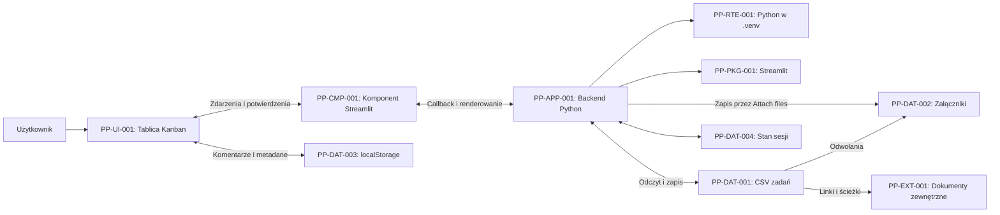

# CMDB — Project Planner KANBAN BOARD

CMDB (Configuration Management Database) to rejestr elementów konfiguracji aplikacji i relacji między nimi. Ten dokument oraz powiązane pliki CSV opisują aktualny kod i sprawdzone środowisko lokalne. Rejestr nie zastępuje bazy ticketów i nie zmienia sposobu przechowywania komentarzy ani załączników.

## Metryka

| Pole | Wartość |
| --- | --- |
| Aplikacja | Project Planner KANBAN BOARD |
| Data inwentaryzacji | 2026-09-11 |
| Repozytorium | [seba-bb/Project-Planner-KANBAN-BOARD](https://github.com/seba-bb/Project-Planner-KANBAN-BOARD) |
| Gałąź | `master` |
| Wersja kodu objęta opisem | `95f62b103b971fdd07a63fce4a7180263efb0833` |
| Sprawdzone środowisko | Lokalny katalog `/home/sebastian/Projekty/PP` |
| Właściciel biznesowy | Do ustalenia |
| Właściciel techniczny | Do ustalenia |
| Serwer produkcyjny, adres usługi i administrator serwera | Niepotwierdzone |
| Zakres rejestru | 17 elementów konfiguracji i 25 relacji |

Są to dane z inwentaryzacji, a nie automatyczny odczyt bieżącego stanu środowiska. Zmiany aplikacji wymagają aktualizacji rejestru.

## Pliki rejestru

- [configuration_items.csv](docs/cmdb/configuration_items.csv) — elementy konfiguracji, identyfikatory, lokalizacje, wersje, odpowiedzialność i źródła informacji.
- [relationships.csv](docs/cmdb/relationships.csv) — relacje między elementami, powiązane przez identyfikatory CI.

CSV używają przecinka jako separatora i kodowania UTF-8 z BOM. Można je importować do Excela, arkusza lub narzędzia CMDB. Pola `owner` mają wartość „Do ustalenia”; nazwa użytkownika systemu czy konta GitHub nie stanowi potwierdzenia odpowiedzialności za usługę.

## Rejestr elementów konfiguracji

| CI | Element | Lokalizacja / wersja | Stan |
| --- | --- | --- | --- |
| PP-SVC-001 | Usługa Project Planner KANBAN BOARD | Całość aplikacji | Zaimplementowana; wdrożenie produkcyjne niepotwierdzone |
| PP-APP-001 | Backend i formularze | [app.py](app.py) | W Git |
| PP-UI-001 | Tablica HTML/CSS/JavaScript | `build_board_html()` w `app.py` | Generowana przez aplikację |
| PP-CMP-001 | Komunikacja tablicy ze Streamlit | [index.html](assets/kanban_component/index.html) | Komponent v1, `postMessage` |
| PP-ENV-001 | Lokalne środowisko PP | `/home/sebastian/Projekty/PP` | Potwierdzone lokalnie |
| PP-RTE-001 | Python w `.venv` | `.venv/bin/python`, Python **3.12.3** | Zainstalowany |
| PP-PKG-001 | Streamlit | Lokalnie **1.63.0** | Rozbieżność z deklaracją zależności |
| PP-CFG-001 | Deklaracja zależności | [requirements.txt](requirements.txt): **1.60.0** | W Git |
| PP-CFG-002 | Domyślne opcje aplikacji | Stałe `DEFAULT_*` w `app.py` | W Git |
| PP-DAT-001 | Baza zadań | `project_planner_actions.csv` | Istnieje lokalnie; poza Git |
| PP-DAT-002 | Przesłane załączniki | `attachments/<podfolder-zadania>/` | Obsługiwane; katalog nie istniał podczas inwentaryzacji |
| PP-DAT-003 | Komentarze i pozostałe metadane | Browser localStorage: `ewm-task-meta:<ticket-id>` | Lokalnie w przeglądarce |
| PP-DAT-004 | Stan sesji | `st.session_state` | Nietrwały stan sesji |
| PP-EXT-001 | Dokumenty wskazane linkiem / ścieżką | Zewnętrzny system plików lub URL | Obsługa odwołań; konkretne zasoby niezinwentaryzowane |
| PP-SRC-001 | Repozytorium kodu | GitHub, gałąź `master` | Skonfigurowane |
| PP-TST-001 | Testy trwałości danych | [test_task_persistence.py](tests/test_task_persistence.py) | W Git |
| PP-AST-001 | Ikona i znak aplikacji | `assets/project_planner_icon.png`, `.svg` | W Git |

Wersje interpretera i pakietu odczytano przez `.venv/bin/python`. Wersja w `requirements.txt` jest deklaracją repozytorium, a nie potwierdzeniem wersji zainstalowanej na innym serwerze. CMDB nie zmieniła tych wersji.

## Mapa zależności



Diagram pokazuje główne połączenia. Pełny rejestr relacji znajduje się w `relationships.csv`.

## Lokalizacja i trwałość danych

| Dane | Gdzie są zapisywane | Zachowanie po odświeżeniu / nowej sesji |
| --- | --- | --- |
| Tytuł, status, projekt, termin, opis, odpowiedzialne osoby | `project_planner_actions.csv` na serwerze aplikacji | Odtwarzane z CSV |
| Identyfikator ticketu | Pole `id` w CSV | Trwały; starsze pliki otrzymują identyfikatory podczas odczytu |
| Linki i ścieżki załączników | Pole `attachments` w CSV | Odtwarzane z CSV; dostępność dokumentu zależy od miejsca jego przechowywania |
| Bajty pliku przesłanego przez akcję **Attach files** | Podfolder w `attachments/` | Pozostają w systemie plików |
| Komentarze, aktywności, checklisty, historia terminów | localStorage w profilu przeglądarki dla danego origin | Pozostają w tej przeglądarce, o ile zapis jest dostępny i dane nie zostały usunięte |
| Filtry i obsługa formularzy | `st.session_state` | Stan danej sesji |
| Opcje kolumn, ról, projektów, osób i kolory | Wartości domyślne oraz stan sesji | Część opcji odtwarzana z ticketów; osobny trwały rejestr ustawień nie istnieje |

Pełna lokalna ścieżka bazy zadań: `/home/sebastian/Projekty/PP/project_planner_actions.csv`.

`attachments/` jest lokalizacją przewidzianą w kodzie. Nie należy traktować obecności funkcji uploadu jako potwierdzenia istnienia konkretnych przesłanych plików.

### Schemat CSV zadań — PP-DAT-001

| Pole | Format | Znaczenie |
| --- | --- | --- |
| `id` | Tekst, identyfikator generowany przez UUID | Powiązanie ticketu z edycją i metadanymi |
| `title` | Tekst | Tytuł zadania |
| `owner` | Tekst | Rola / odpowiedzialny obszar |
| `responsible_emails` | Lista JSON w komórce CSV | Adresy osób przypisanych do zadania |
| `status` | Tekst | Kolumna Kanban; wartości konfigurowalne |
| `due` | Tekst daty; formularze zapisują `YYYY-MM-DD` | Termin zadania |
| `project_id` | Tekst | Identyfikator projektu |
| `project` | Tekst | Nazwa projektu |
| `description` | Tekst | Opis zadania |
| `attachments` | Lista JSON w komórce CSV | Nazwy, ścieżki lub linki do plików |
| `email_notification` | `true` / `false` | Flaga opcji e-mail; sama flaga nie oznacza wysłania wiadomości |

Plik jest zapisywany w UTF-8 z BOM. Zapis korzysta z pliku tymczasowego i `os.replace()`. To chroni przed pozostawieniem częściowo nadpisanego CSV przy błędzie zapisu, ale nie zapewnia transakcji ani blokowania równoczesnych edycji wielu użytkowników.

### Metadane przeglądarki — PP-DAT-003

Klucz `ewm-task-meta:<ticket-id>` przechowuje JSON z polami `checklist`, `comments`, `activity` i `due_history`. Są to odrębne dane względem CSV. Nie są współdzielone pomiędzy profilami przeglądarek; zmiana adresu aplikacji może również oznaczać inny origin i inny obszar localStorage.

Kod ogranicza listę aktywności do ostatnich 30 wpisów, a historię poprzednich terminów do 5 pozycji. Nie jest to pełny, centralny dziennik audytowy. Nazwa autora aktywności jest wyprowadzana z wybranych adresów osób, a nie z uwierzytelnionej tożsamości.

## Interfejsy i granice integracji

| Interfejs | Rzeczywiste zachowanie |
| --- | --- |
| Tablica ↔ backend | Komponent Streamlit v1 przekazuje zdarzenia zapisu ticketu i żądania otwarcia formularza nowego zadania |
| Zapis zadania | Callback aktualizuje CSV i stan sesji; wynik zapisu jest przekazywany do tablicy |
| Pobieranie CSV | Przycisk **Download actions CSV** eksportuje zadania ze stanu bieżącej sesji |
| Pliki lokalne | Rozpoznane pliki są udostępniane przez odnośniki `data:`; edycja pobranej kopii nie nadpisuje pliku źródłowego |
| Dokumenty HTTP/HTTPS | Link otwiera zasób zewnętrzny; uprawnienia i zapis dokumentu należą do systemu źródłowego |
| Ścieżki serwerowe | Aplikacja może przechować ścieżkę; nie ma wdrożonego mechanizmu edycji pliku na udziale sieciowym |
| E-mail | Dostępny jest odnośnik `mailto:` do przygotowania wiadomości; automatyczna wysyłka SMTP nie jest zaimplementowana |

Przyciski uploadu w formularzu tworzenia ticketu i w edytorze karty zapisują obecnie nazwy nowych plików. Zapis bajtów pliku implementuje `add_attachments_to_task()`, wywoływane przez akcję **Attach files**. To ograniczenie kodu objętego inwentaryzacją, a nie funkcja naprawiona przy tworzeniu CMDB.

## Uruchomienie i weryfikacja

Z katalogu aplikacji, z wykorzystaniem istniejącego środowiska wirtualnego:

```bash
source .venv/bin/activate
python -m streamlit run app.py
```

Testy trwałości danych:

```bash
.venv/bin/python -m unittest discover -s tests -v
```

W katalogu projektu nie znaleziono `.streamlit/config.toml`, `Dockerfile`, `docker-compose.yml` ani `.github/workflows/`. Nie sprawdzano konfiguracji globalnej, usług systemowych, proxy ani zewnętrznego hostingu. Na tej podstawie nie można ustalić adresu, portu ani sposobu zarządzania produkcyjną instancją.

## Odtwarzanie i kopie danych

Poniżej opisano zakres potrzebny do odtworzenia aplikacji. Harmonogram kopii, lokalizacja backupu, retencja, RPO i RTO nie zostały potwierdzone.

| Element | Co należy zachować | Skutek braku kopii |
| --- | --- | --- |
| Kod i zasoby | Repozytorium z wybraną wersją kodu | Brak odtwarzalnej wersji aplikacji |
| CSV zadań | `project_planner_actions.csv` | Utrata ticketów; aplikacja bez pliku tworzy dane przykładowe |
| Przesłane pliki | Cały katalog `attachments/`, jeśli istnieje | Odwołania w CSV mogą pozostać bez plików |
| Metadane przeglądarki | Dane localStorage z właściwych profili i origin | Komentarze i checklisty nie zostaną odtworzone z CSV |
| Dokumenty zewnętrzne | Kopie zarządzane przez właściciela systemu dokumentów | Sam link w tickecie nie pozwoli odzyskać dokumentu |
| Ustawienia i środowisko | Uzgodniona wersja Python/Streamlit i ewentualna konfiguracja wdrożenia | Możliwe różnice działania po ponownym uruchomieniu |

Proponowana kolejność odtworzenia:

1. Przywrócić wybraną wersję repozytorium do docelowego katalogu.
2. Odtworzyć `.venv` z uzgodnionymi wersjami; przed instalacją rozstrzygnąć różnicę Streamlit 1.60.0 / 1.63.0.
3. Przed pierwszym uruchomieniem odtworzyć CSV i katalog załączników oraz zapewnić uprawnienia zapisu do katalogu danych.
4. Uruchomić aplikację i sprawdzić przykładowy ticket, przypisane osoby, status oraz dostęp do załącznika.
5. Osobno zweryfikować dane localStorage i dokumenty zewnętrzne — nie należą do kopii CSV.

Ta procedura nie została wykonana jako test odtworzenia. CMDB nie ustanawia automatycznych kopii zapasowych.

## Elementy wymagające uzupełnienia

| Obszar | Stan ustalony podczas inwentaryzacji | Informacja lub decyzja do uzupełnienia |
| --- | --- | --- |
| Odpowiedzialność | Brak przypisanych właścicieli CI | Właściciel biznesowy, techniczny, administrator danych i zastępstwa |
| Wdrożenie | Potwierdzono tylko lokalny katalog PP | Nazwa serwera, adres aplikacji, sposób uruchomienia, monitoring i dostęp |
| Wersje | Wymagane 1.60.0, zainstalowane 1.63.0 | Wersja Streamlit przyjęta jako bazowa dla wdrożenia |
| Dane współdzielone | CSV zadań oraz odrębne localStorage | Docelowe miejsce centralnego przechowywania komentarzy i ustawień |
| Równoczesna edycja | CSV bez blokady transakcyjnej | Docelowy model współpracy wielu użytkowników |
| Załączniki | Osobny zapis przez Attach files; ograniczenia pozostałych uploadów | Docelowy model: upload z wersjami czy odwołania do wspólnych dokumentów |
| Dostęp użytkowników | Brak uwierzytelniania i autoryzacji w kodzie | Wymagany sposób identyfikacji użytkowników i nadawania uprawnień |
| Backup | Brak potwierdzonego procesu | Właściciel, harmonogram, retencja, lokalizacja i test odtworzenia |

PostgreSQL, centralne komentarze, logowanie użytkowników i automatyczne powiadomienia pozostają kierunkami rozwoju opisanymi w README. Nie zostały wpisane jako działające elementy konfiguracji.

## Utrzymanie CMDB

Po zmianie wersji, miejsca przechowywania danych, zależności lub wdrożenia:

1. Zaktualizować właściwy wiersz `configuration_items.csv`, w tym `status`, `version`, `location`, `evidence` i `owner`.
2. Dodać lub zmienić relacje w `relationships.csv`; identyfikatory CI powinny pozostać stabilne.
3. Zaktualizować `reviewed_on`, `baseline_commit` oraz opis w tym dokumencie.
4. Sprawdzić, czy każdy identyfikator użyty w relacjach istnieje w rejestrze CI.
5. Zapisać aktualizację CMDB w Git wraz ze zmianą aplikacji.

Do rejestru należy wpisywać źródła konfiguracji i identyfikatory elementów, bez haseł, tokenów, kluczy prywatnych czy zawartości ticketów.
